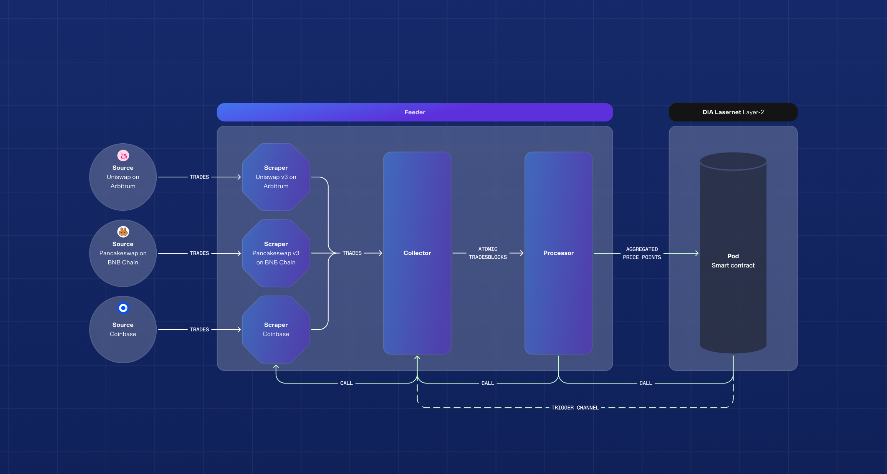

<p align="center">
    
</p>

# decentral-feeder


[](https://twitter.com/DIAdata_org)

The node setup instructions are available in our [Wiki](https://github.com/diadata-org/decentral-feeder/wiki) page!

This repository hosts a self-contained containerized application for running a data feeder in the Lumina oracle network. It comprises of three main components: scraper, collector, and processor. The scraper collects trade data from various CEXs and DEXs. The collector and processor aggregate the data through a two-step process to produce a scalar value associated with an asset, which is subsequently published on-chain. In most cases, this value represents the asset's price in USD.

<p align="center">
    
    <br>
    <em>Decentralized feeder's components</em>
</p>

## Requirements

- Docker or Docker Compose installed

- Container has minimal resource requirements, making it suitable for most machines, including Windows, macOS, Linux, and Raspberry Pi, as long as Docker is installed.

- ETH private key from MetaMask or any other Eth wallet. Alternatively to generate a private key effortlesly, [eth-keys](https://github.com/ethereum/eth-keys) tool can be used for this.

- DIA tokens in your wallet. For running a node in testnet, you can request tokens from the [faucet](https://faucet.diadata.org).

## Quick Start

> **NOTE:** This guide is using docker compose for running a feeder node. You can explore alternative deployment methods [here](https://github.com/diadata-org/decentral-feeder/wiki/Node-deployment#alternative-deployment-methods).

### Navigate to the Docker Compose Folder

- Locate the `docker-compose` folder in this repository.
- Inside, you will find a file named `docker-compose.yaml`.

### Configure Environment Variables

- Create a `.env` file in the same directory as `docker-compose.yaml`. This file should contain the following variables:

  - `NODE_OPERATOR_NAME`: A unique and descriptive name identifying the organization or entity running the node. This name is used for monitoring and should be chosen carefully to ensure it is both meaningful and recognizable (e.g., include your organization name or geographical region). Providing a clear name helps distinguish your node in dashboards and logs.
  - `CHAIN_ID`: set the chain ID value
  - `BLOCKCHAIN_NODE`: set the RPC Endpoint # https://testnet-rpc.diadata.org for testnet, https://rpc.diadata.org for mainnet
  - `PRIVATE_KEY`: Your private key for the deployment.
  - `DEPLOYED_CONTRACT`: The contract address. Initially, leave this empty during the first deployment to retrieve the deployed contract.
  - `ENABLE_METRICS_SERVER`: Set to `true` to enable the metrics server. This will start a local server that serves the metrics of the feeder node.
  - `METRICS_PORT`: The port on which the metrics server will run, defaults to `9090`. for more monotiring info refer to [Monitoring](https://github.com/diadata-org/decentral-feeder/wiki/Monitoring)

    > **NOTE:** The following pushgateway vars are **mandatory** for official DIA node operators. If you're an official operator, please reach out to the team to get these credentials. For developers testing the system, these credentials are **optional** and can be skipped.

  - `PUSHGATEWAY_URL`: The Pushgateway endpoint used for pushing metrics to Prometheus.
  - `PUSHGATEWAY_USER`: to allow decentralized-feeder authenticate towards the monitoring server.
  - `PUSHGATEWAY_PASSWORD`: to allow decentralized-feeder authenticate towards the monitoring server.

  For additional environment variable configurations, refer to [Adding Exchange Pairs](https://github.com/diadata-org/decentral-feeder/wiki/Adding-exchange-pairs) and [Watchdog environment variables](https://github.com/diadata-org/decentral-feeder/wiki/Enabling-watchdogs)

- Example `.env` file:

  ```plaintext
  NODE_OPERATOR_NAME=
  CHAIN_ID=
  BLOCKCHAIN_NODE=
  PRIVATE_KEY=
  DEPLOYED_CONTRACT=
  PUSHGATEWAY_URL=
  PUSHGATEWAY_USER=
  PUSHGATEWAY_PASSWORD=
  ```

- Open a terminal in the `docker-compose` folder and start the deployment by running:
  ```bash
  docker-compose up
  ```

### Retrieve Deployed Contract

- Once the container is deployed with `DEPLOYED_CONTRACT` env variable empty the logs will display the deployed contract address in the following format:
  ```plaintext
  │ time="2024-11-25T11:30:08Z" level=info msg="Contract pending deploy: 0xxxxxxxxxxxxxxxxxxxxxxxxxx."
  ```
- Copy the displayed contract address (e.g., `0xxxxxxxxxxxxxxxxxxxxxxxxxx`) and stop the container with `docker rm -f <container_name>`.

- Update your `.env` file with `DEPLOYED_CONTRACT` variable mentioned above. Redeployed the container with `docker-compose up -d`

  ```plaintext
  DEPLOYED_CONTRACT=0xxxxxxxxxxxxxxxxxxxxxxxxxx
  ```

- Check if the container is running correctly by viewing the logs. Run the following command:

  ```bash
  docker-compose logs -f
  ```

- Expected Logs: Look for logs similar to the example below, which indicate a successful startup:

  ```
  │ time="2024-10-29T13:39:35Z" level=info msg="Processor - Atomic filter value for market Binance:SUSHI-USDT with 20 trades: 0.7095307176575745."                                                                  │
  │ time="2024-10-29T13:39:35Z" level=info msg="Processor - Atomic filter value for market Simulation:UNI-USDC with 1 trades: 8.008539500390082."                                                                   │
  │ time="2024-10-29T13:39:35Z" level=info msg="Processor - Atomic filter value for market Crypto.com:USDT-USD with 5 trades: 0.99948."                                                                             │
  │ time="2024-10-29T13:39:35Z" level=info msg="Processor - filter median for MOVR: 9.864475653518195."                                                                                                             │
  │ time="2024-10-29T13:39:35Z" level=info msg="Processor - filter median for STORJ: 0.4672954012114179."                                                                                                           │
  │ time="2024-10-29T13:39:35Z" level=info msg="Processor - filter median for DIA: 0.9839597410694259."                                                                                                             │
  │ time="2024-10-29T13:39:35Z" level=info msg="Processor - filter median for WETH: 2626.9564003841315."
  ```

- You can optionally cleanup the deployment once you're done by running:

  ```
  docker rm -f <container_name>
  ```

- Verify the container has been removed:
  ```
  docker ps -a
  ```

## Supported Assets

The feeder currently supports sourcing the following asset feeds:

- Token Price Feeds (default setup)
- Real-World Assets (RWAs) Feeds
- Fundamental (or Fair-value) Feeds

> **NOTE:** For the complete list of environment variables required for each service, see [here](/docker-compose/).

### Adding RWA Assets

To add RWA assets to your feeder, follow the instructions in [Adding RWA Assets](https://github.com/diadata-org/decentral-data-feeder/wiki/Adding-RWA-Assets) page.

### Adding fair-value feeds

To add fair-value feeds to your feeder, follow the instructions in [Adding fair-value feeds](https://github.com/diadata-org/fair-value/wiki/Adding-Fair%E2%80%90value-Feeds) page.

If you're running a feeder for exchange pairs, then you can structure the deployment of all services at once in your `docker-compose.yaml` file as follows:

```yaml
services:
  fair-value-feeder:
    image: diadata/fair-value:<VERSION>
    # for latest image versions see https://hub.docker.com/r/diadata/fair-value-feeder/tags
    env_file:
      - .env.fair-value-feeder
    restart: always
  twelvedata-data-feeder:
    image: diadata/decentralized-data-feeder:<VERSION>
    # for latest image versions see https://hub.docker.com/r/diadata/decentralized-data-feeder/tags
    env_file:
      - .env-twelvedata
    restart: always
  decentralized-feeder:
    image: diadata/decentralized-feeder:scraper-<VERSION>
    # for latest image versions see https://hub.docker.com/r/diadata/decentralized-feeder/tags
    env_file:
      - .env.decentralized-feeder
    restart: always
```

## Error Handling

> **NOTE:** This guide is specific to docker compose. You can check how to handle errors based on your deployment method [here](https://github.com/diadata-org/decentral-feeder/wiki/Error-Handling).

If any issues arise during deployment, follow these steps:

#### Check Logs:

- Run `docker-compose logs -f`

#### Verify Environment Variables:

- Ensure all required variables (`PRIVATE_KEY`, `DEPLOYED_CONTRACT`) are correctly set by checking the `.env` file.

#### Restart Deployment:

- ```bash
  docker-compose down && docker-compose up -d
  ```

#### Update or Rebuild:

- Ensure you're using the correct image version:
  ```bash
  docker pull diadata/decentralized-feeder:<VERSION>
  ```
- Apply fixes and redeploy.

## Documentation

For the full node deployment instructions, you can visit our [Wiki](https://github.com/diadata-org/decentral-feeder/wiki) page.

To learn about DIA's oracle stacks, you can visit our documentation [here](https://docs.diadata.org/).

## Issues

To report bugs or suggest enhancements, you can create a [Github Issue](https://docs.github.com/en/issues/tracking-your-work-with-issues/using-issues/creating-an-issue) in the repository.

## Contribution Guidelines

Coming soon...

## Community

You can find our team on the following channels:

- [Discord](https://discord.com/invite/RjHBcZ9mEH)
- [Telegram](https://t.me/diadata_org)
- [X](https://x.com/DIAdata_org)
