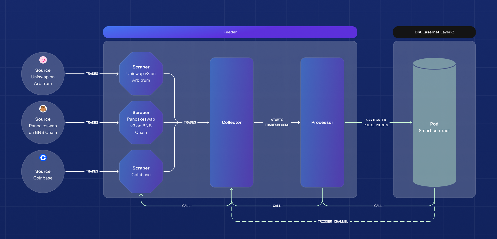

## Table of Contents
 - [Overview](#overview)
 - [Resources](#resources)
 - [Detailed Description of the Building Blocks](#detailed-description-of-the-building-blocks)
   - [Scrapers](#scrapers)
   - [Collector](#collector)
   - [Processor](#processor)
   - [Feeder](#feeder)
 - [Smart Contract Documentation](contracts/README.md)
 - [Node Deployment Guide](#node-deployment-guide)
   - [Requirements](#requirements)
   - [Docker Compose Deployment](#docker-compose-deployment)
     - [Navigate to the Docker Compose Folder](#navigate-to-the-docker-compose-folder)
     - [Configure Environment Variables](#configure-environment-variables)
     - [Retrieve Deployed Contract](#retrieve-deployed-contract)
     - [Run Docker Compose](#run-docker-compose)
   - [Alternative Deployment Methods](#alternative-deployment-methods)
     - [Docker Run Deployment](#docker-run-deployment)
     - [Kubernetes Deployment](#kubernetes-deployment)
   - [Adding Exchange Pairs](#adding-exchange-pairs)
   - [Error Handling](#error-handling)
- [Conclusion](#conclusion)


# Overview

This repository hosts a self-contained containerized application comprising three main components: scraper, collector, and processor. The scraper collects trade data from various centralized and decentralized exchanges. The collector and processor aggregate the data through a two-step process to produce a scalar value associated with an asset, which is subsequently published on-chain. In most cases, this value represents the asset's price in USD.


## Resources

| **Field**         | **Value**                                                                                      |
|--------------------|-----------------------------------------------------------------------------------------------|
| **Chain name**     | DIA Lasernet Testnet                                                                          |
| **Chain ID**       | 10640                                                                                         |
| **Block explorer** | [https://testnet-explorer.diadata.org](https://testnet-explorer.diadata.org)                  |
| **RPC URL**        | [https://testnet-rpc.diadata.org](https://testnet-rpc.diadata.org)                            |
| **Websocket**      | [wss://testnet-rpc.diadata.org](wss://testnet-rpc.diadata.org)                                |
| **Gas token**      | DIA on ETH Sepolia `0xa35a89390FcA5dB148859114DADe875280250Bd1`                               |
| **Faucet**         | [https://faucet.diadata.org](https://faucet.diadata.org)                                      |
| **Documentation**  | [https://docs.diadata.org](https://docs.diadata.org)                                          |


# Detailed Description of the Building Blocks


In the following sections, we describe the function and usage of the building blocks (the three components mentioned earlier) that make up the system (see figure). The explanation proceeds from left to right


## Scrapers
Each scraper is implemented in a dedicated file in the folder /pkg/scrapers with the main function signature `func NewExchangeScraper(pairs []models.ExchangePair, tradesChannel chan models.Trade, wg *sync.WaitGroup)`, 
resp. `pools` instead of `pairs` for decentralized exchanges.\
Its function is to continuously fetch trades data from a given exchange and send them to the channel `tradesChannel`.\
The expected input for a scraper is a set of pair tickers such as `BTC-USDT`. Tickers are always capitalized and symbols separated by a hyphen. It's the role of the scraper to format the pair ticker such that it can subscribe to
 the corresponding (websocket) stream. \
For centralized exchanges, a json file in /config/symbolIdentification is needed that assigns blockchain and address to each ticker symbol the scraper is handling.

## Collector
The collector gathers trades from all running scrapers. As soon as it receives a signal through a trigger channel it bundles trades in *atomic tradesblocks*. An atomic tradesblock is a set of trades restricted to one market on one exchange, for instance `BTC-USDT` trades on Binance exchange. These tradesblocks are sent to the `Processor`.

## Processor
The processor is a 2-step aggregation procedure similar to mapReduce.\
1. Step: Aggregate trades from an atomic tradesblock. The type of aggregation can be selected through an environment variable (see Feeder/main). The only assumption on the aggregation implementation is that it returns a `float64`.
2. Step: Aggregate filter values obtained in step 1. The selection of aggregation method and assumptions are identical to Step 1.
The obtained scalar value is sent to the Oracle feeder.

## Feeder
The feeder is feeding a simple key value oracle. It publishes the value obtained from the Processor. It is worth mentioning that the feeder can contain the trigger mechanism that initiates an iteration of the data flow diagram.

## Smart Contract Documentation
For more details about the contracts, refer to the following documentation:

[Smart Contract Documentation](contracts/README.md)


# Node Deployment Guide

This document outlines the procedures for deploying the `diadata/decentralized-feeder:<VERSION>` containerized application. Replace `<VERSION>` with the desired version (e.g., `v0.0.4`, `v0.0.5`, etc.) when deploying.

## Requirements

- Ensure that Docker or Docker Compose is installed on your machine.

- Clone this repository to your local machine.

- The container has minimal resource requirements, making it suitable for most machines, including Windows, macOS, Linux, and Raspberry Pi, as long as Docker is installed.


## Docker Compose Deployment

###  Navigate to the Docker Compose Folder
   - Locate the `docker-compose` folder in this repository.
   - Inside, you will find a file named `docker-compose.yaml`.

###  Configure Environment Variables
   - Create a `.env` file in the same directory as `docker-compose.yaml`. This file should contain the following variables:
     - `PRIVATE_KEY`: Your private key for the deployment.
     - `DEPLOYED_CONTRACT`: The contract address. Initially, leave this empty during the first deployment to retrieve the deployed contract.

   - Example `.env` file:
     ```plaintext
     PRIVATE_KEY=myprivatekey
     DEPLOYED_CONTRACT=
     ```

   - Open a terminal in the `docker-compose` folder and start the deployment by running:
      ```bash
      docker-compose up
      ```

###  Retrieve Deployed Contract
   - Once the container is deployed with `DEPLOYED_CONTRACT` env variable empty the logs will display the deployed contract address in the following format:
     ```plaintext
     │ time="2024-11-25T11:30:08Z" level=info msg="Contract pending deploy: 0xxxxxxxxxxxxxxxxxxxxxxxxxx."
     ```
   - Copy the displayed contract address (e.g., `0xxxxxxxxxxxxxxxxxxxxxxxxxx`) and stop the container with `docker rm -f <container_name>`.

   - Update your `.env` file with `DEPLOYED_CONTRACT` variable mentioned above. Redeployed the container with  `docker-compose up -d`
     ```plaintext
     PRIVATE_KEY=myprivatekey
     DEPLOYED_CONTRACT=0xxxxxxxxxxxxxxxxxxxxxxxxxx
     ```

   - Check if the container is running correctly by viewing the logs. Run the following command:
     ```bash
     docker-compose logs -f
     ```

   - Expected Logs: Look for logs similar to the example below, which indicate a successful startup:
     ```
     │ time="2024-10-29T13:39:35Z" level=info msg="Processor - Atomic filter value for market Binance:SUSHI-USDT with 20 trades: 0.7095307176575745."                                                                  │
     │ time="2024-10-29T13:39:35Z" level=info msg="Processor - Atomic filter value for market Simulation:UNI-USDC with 1 trades: 8.008539500390082."                                                                   │
     │ time="2024-10-29T13:39:35Z" level=info msg="Processor - Atomic filter value for market Crypto.com:USDT-USD with 5 trades: 0.99948."                                                                             │
     │ time="2024-10-29T13:39:35Z" level=info msg="Processor - filter median for MOVR: 9.864475653518195."                                                                                                             │
     │ time="2024-10-29T13:39:35Z" level=info msg="Processor - filter median for STORJ: 0.4672954012114179."                                                                                                           │
     │ time="2024-10-29T13:39:35Z" level=info msg="Processor - filter median for DIA: 0.9839597410694259."                                                                                                             │
     │ time="2024-10-29T13:39:35Z" level=info msg="Processor - filter median for WETH: 2626.9564003841315."   
     ```
    
   - Cleanup the deployment:
      ```
      docker rm -f <container_name>
      ```
   - Verify the container has been removed
      ```
      docker ps -a
      ```


## Alternative Deployment Methods

###  Docker Run Deployment

This method is suitable for simple setups without orchestration.

#### Command
   - Deploy the feeder with `DEPLOYED_CONTRACT` initially empty:
     ```bash
     docker run -d \
       -e PRIVATE_KEY=myprivatekey \
       -e DEPLOYED_CONTRACT= \
       --name decentralized-feeder \
       diadata/decentralized-feeder:<VERSION>
     ```
   - Retrieve the logs to get the deployed contract address:
     ```bash
     docker logs <container_name>
     ```
   - Stop the container, update the `DEPLOYED_CONTRACT` value, and restart:
     ```bash
     docker stop <container_name>
     docker run -d \
       -e PRIVATE_KEY=myprivatekey \
       -e DEPLOYED_CONTRACT=0xxxxxxxxxxxxxxxxxxxxxxxxxx \
       --name decentralized-feeder \
       diadata/decentralized-feeder:<VERSION>
     ```
   - Retrieve the logs to verify the container is running as expected
      ```bash
      docker logs <container_name>
      ```


###  Kubernetes Deployment

Kubernetes is ideal for production environments requiring scalability and high availability.

#### Deployment YAML
   - Create a Kubernetes `Deployment` manifest. Replace `<VERSION>` with the desired version:
     ```yaml
     apiVersion: apps/v1
     kind: Deployment
     metadata:
       name: decentralized-feeder
       namespace: default
     spec:
       replicas: 1
       selector:
         matchLabels:
           app: decentralized-feeder
       template:
         metadata:
           labels:
             app: decentralized-feeder
         spec:
           containers:
           - name: feeder-container
             image: diadata/decentralized-feeder:<VERSION>
             env:
             - name: PRIVATE_KEY
               value: "myprivatekey"
             - name: DEPLOYED_CONTRACT
               value: ""
             - name: EXCHANGEPAIRS
               value: ""
             - containerPort: 8080
     ```

#### Steps to Deploy
   1. Deploy the feeder with `DEPLOYED_CONTRACT` set to an empty string (`""`) in the Kubernetes manifest.
   2. Monitor the logs for the deployed contract address:
      ```bash
      kubectl logs <pod-name>
      ```
   3. Update the `DEPLOYED_CONTRACT` value in the manifest with the retrieved contract address.
   4. Apply the updated manifest:
      ```bash
      kubectl apply -f deployment.yaml
      ```


### Adding Exchange Pairs

To configure exchange pairs for the decentralized feeder, use the `EXCHANGEPAIRS` environment variable. This can be done regardless of the deployment method. The variable specifies pairs to scrape from various exchanges, formatted as a comma-separated list of `<Exchange>:<Asset-Pair>` (e.g., `Binance:BTC-USDT`).


#### Steps to Add Exchange Pairs

Locate the environment configuration file or section for your deployment method:
   - For Docker Compose: Use the `.env` file or add directly to the `docker-compose.yaml` file.
   - For Kubernetes: Update the kubernetes manifest file `manifest.yaml`
   - For Docker Run: Pass the variable directly using the `-e` flag.

### Define the `EXCHANGEPAIRS` variable with your desired pairs as a comma-separated list.

   - Example in docker-compose:
     ```plaintext
     EXCHANGEPAIRS=" 
     Binance:TON-USDT, Binance:TRX-USDT, Binance:UNI-USDT, Binance:USDC-USDT, Binance:WIF-USDT,
     CoinBase:AAVE-USD, CoinBase:ADA-USD, CoinBase:AERO-USD, CoinBase:APT-USD, CoinBase:ARB-USD,
     GateIO:ARB-USDT, GateIO:ATOM-USDT, GateIO:AVAX-USDT, GateIO:BNB-USDT, GateIO:BONK-USDT,
     Kraken:AAVE-USD, Kraken:ADA-USD, Kraken:ADA-USDT, Kraken:APT-USD, Kraken:ARB-USD,
     KuCoin:AAVE-USDT, KuCoin:ADA-USDT, KuCoin:AERO-USDT, KuCoin:APT-USDT, KuCoin:AR-USDT,
     Crypto.com:BONK-USD, Crypto.com:BTC-USDT, Crypto.com:BTC-USD, Crypto.com:CRV-USD
     "
     ```
     start the container with:
     ```
     docker compose up 
     ```

   - Example in Kubernetes manifest:
     Modify the environment variables in the env section of the  Deployment specification.
       ```yaml
      spec:
        containers:
        - name: feeder-container
          image: diadata/decentralized-feeder:<VERSION>
          env:
          - name: PRIVATE_KEY
            value: "myprivatekey"
          - name: DEPLOYED_CONTRACT
            value: ""
          - name: EXCHANGEPAIRS
            value: "
            Binance:TON-USDT, Binance:TRX-USDT, Binance:UNI-USDT, Binance:USDC-USDT, Binance:WIF-USDT,
            CoinBase:AAVE-USD, CoinBase:ADA-USD, CoinBase:AERO-USD, CoinBase:APT-USD, CoinBase:ARB-USD
            "
          ports:
          - containerPort: 8080
       ```
     - Apply the changes with:
       ```bash
       kubectl apply -f `manifest.yaml` 
       ```
   - Example in Docker Run:
     ```bash
     docker run -d \
      -e PRIVATE_KEY=your-private-key \
      -e DEPLOYED_CONTRACT=your-contrract \
      -e EXCHANGEPAIRS="Binance:TON-USDT, Binance:TRX-USDT" \
      --name decentralized-feeder \
      diadata/decentralized-feeder:<VERSION>

     ```

 ### Verify the configuration:
   - Docker Compose: Check logs with:
     ```bash
     docker-compose logs -f
     ```
   - Kubernetes: Check pod logs:
     ```bash
     kubectl logs <pod-name>
     ```
   - Docker Run: View logs with:
     ```bash
     docker logs <container-name>
     ```
   - The output should look like:
     ```
      lasernet-feeder-1  | time="2024-11-26T12:22:47Z" level=info msg="Processor - Start......"
      lasernet-feeder-1  | time="2024-11-26T12:22:47Z" level=info msg="CoinBase - Started scraper."
      lasernet-feeder-1  | time="2024-11-26T12:22:47Z" level=info msg="Kraken - Started scraper."
      lasernet-feeder-1  | time="2024-11-26T12:22:47Z" level=info msg="GateIO - Started scraper."
      lasernet-feeder-1  | time="2024-11-26T12:22:47Z" level=info msg="KuCoin - Started scraper."
      lasernet-feeder-1  | time="2024-11-26T12:22:47Z" level=info msg="Crypto.com - Started scraper."
      lasernet-feeder-1  | time="2024-11-26T12:22:47Z" level=info msg="Binance - Started scraper at 2024-11-26 12:22:47.97428349 +0000 UTC m=+0.037715635."lasernet-feeder-1  | time="2024-11-26T12:23:08Z" level=info msg="Processor - Atomic filter value for market Binance:USDC-USDT with 89 trades: 0.9998099980000003."
      lasernet-feeder-1  | time="2024-11-26T12:23:08Z" level=info msg="Processor - Atomic filter value for market Binance:UNI-USDT with 47 trades: 10.817108170000003."
      lasernet-feeder-1  | time="2024-11-26T12:23:09Z" level=info msg="Processor - Atomic filter value for market Binance:TRX-USDT with 297 trades: 0.18920189200000007."
      lasernet-feeder-1  | time="2024-11-26T12:23:09Z" level=info msg="Processor - Atomic filter value for market CoinBase:APT-USD with 18 trades: 11.38."
      lasernet-feeder-1  | time="2024-11-26T12:23:09Z" level=info msg="Processor - Atomic filter value for market GateIO:BNB-USDT with 3 trades: 620.9062090000001."
      lasernet-feeder-1  | time="2024-11-26T12:23:09Z" level=info msg="Processor - Atomic filter value for market CoinBase:AERO-USD with 5 trades: 1.27824."
      ....
      ```

### Error Handling

If any issues arise during deployment, follow these steps based on your deployment method:

 #### Check Logs:
   - Docker Compose: `docker-compose logs -f`
   - Docker Run: `docker logs <container_name>`
   - Kubernetes: `kubectl logs <pod-name>`

 #### Verify Environment Variables:
   - Ensure all required variables (`PRIVATE_KEY`, `DEPLOYED_CONTRACT`) are correctly set:
     - Docker Compose: Check `.env` file.
     - Docker Run: Verify `-e` flags.
     - Kubernetes: Check the Deployment manifest or ConfigMap.

 #### Restart Deployment:
   - Docker Compose: 
     ```bash
     docker-compose down && docker-compose up -d
     ```
   - Docker Run: 
     ```bash
     docker stop <container_name> && docker rm <container_name> && docker run -d ...
     ```
   - Kubernetes:
     ```bash
     kubectl delete pod <pod-name>
     ```

 #### Check Configuration:
   - Ensure the correct image version is used and manifests/files are properly configured.

 #### Update or Rebuild:
   - Ensure you're using the correct image version:
     ```bash
     docker pull diadata/decentralized-feeder:<VERSION>
     ```
   - Apply fixes and redeploy.

 

## Conclusion

The `diadata/decentralized-feeder:<VERSION>` image can be deployed using various methods to accommodate different use cases. For production environments, Kubernetes or Helm is recommended for scalability and flexibility. For simpler setups or local testing, Docker Compose or Docker Run is sufficient.

If you encounter any issues or need further assistance, feel free to reach out to the team.


