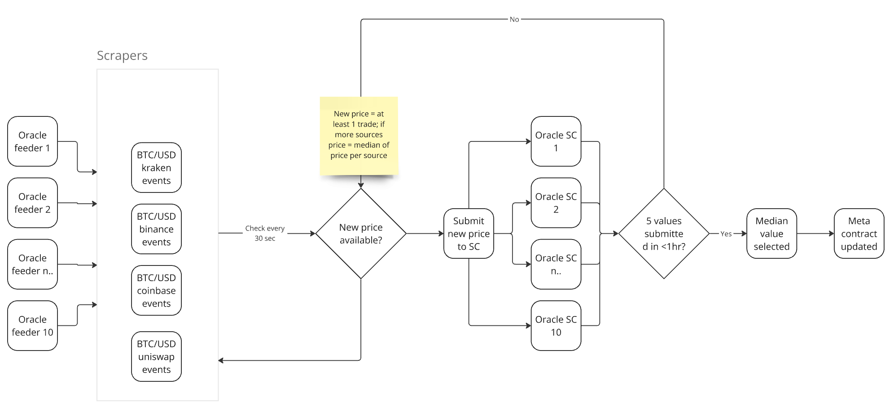

# DIA Lumina oracle contracts

## Overview
The DIA Lumina oracle consists of a two major components:

1. A collection of key/value smart contract that collect price data from each feeder.
2. The DIA metacontract that collates these prices from the key/value contracts and provides an automatically refreshed reading of the latest market price.

An exemplary Lumina data flow can be seen here.
Oracle feeders scrape trades from exchanges and submit these as last prices into their respective oracle contracts.
From there, a threshold of 5 in 1 hour is required for the meta contract to assume consensus on the median value of this set of trades.



## DIA Feeder contracts
Each decentralized Lumina feeder writes data into its own oracle contract.
This feeder contract is a vasic key/value store which stores oracle updates accessible by a key, such as `BTC/USD`.
The data stored for each entry is the last price of the asset and the timestamp of that price.

Each feeder has their own feeder contract, so that it is always clear who made which update.

### Data Packing
In order to pack the data efficiently, the entries (price and timestamp) are packed into the same `uint256` when an update is written to the key/value store.

```solidity
    function setValue(string memory key, uint128 value, uint128 timestamp) public {
        require(msg.sender == oracleUpdater);
        uint256 cValue = (((uint256)(value)) << 128) + timestamp;
        values[key] = cValue;
        emit OracleUpdate(key, value, timestamp);
    }
```

### Usage
It is not necessary to interface with the feeder contract directly.
However, for debugging and transparency purposes it is possible to call `getValue()` in a feeder contract.
This will retrieve the latest price update that is stored for the requested asset.

1. Call `getValue(pairName)` with `pairName` being the full pair name such as BTC/USD.
2. The response of the call contains two values:
   - The current asset price in USD with a fix-comma notation of 8 decimals.
   - The UNIX timestamp of the last oracle update.

## DIA Lumina metacontract
The oracle updates from each feeder contract are collated in the metacontract.

### Usage
The metacontract exposed a simple `Read` function called `getValue()`.
It has one parameter `pairKey`, which consists of the symbol of the queried asset and `/USD` to denominate its price in US Dollars.
For instance, the latest Bitcoin price is queried by calling `getValue("BTC/USD")`.

The function then returns two values:
1. The value of the asset in US Dollars, with 8 decimals.
2. The timestamp of the block with the latest calculation result.

The oracle has several safeguards against becoming stale or having not enough feeders providing updates.

### How it works

#### Methodologies
The current version of the metacontract supports the median methodology.
Later iterations of the metacontract will allow selecting different methodologies for each price evaluation.

#### Roles
Each metacontract has an `admin` address that can setup the metacontract for its specific usage.
The admin is able to add and remove feeders, set a threshold of required feeders, and set a timeout duration after which a feeder update is considered stale.

#### Registering Feeders
The metacontract needs to learn about available feeder key/value storage smart contracts.
The admin can add as many feeders as they wish to the price evaluation using the `addOracle()` method.
The required parameter of that method is the address (on DIA chain) of the key/value smart contract belonging to that feeder.
After an oracle is added, its latest prices are immediately part of the price evaluation.

#### Removing feeders
If needed, oracle feeders can also be removed by the admin.
The required parameter of that method is the address (on DIA chain) of the key/value smart contract belonging to that feeder.
Removal is immediate, so any call made to `getValue()` from the removal block onwards will not include data from the removed feeder any more.

#### Acceptance Threshold
To make price discovery more robust, a threshold needs to be set by the admin.
This threshold corresponds to the number of feeders that need to have submitted a price to reach a valid consensus
